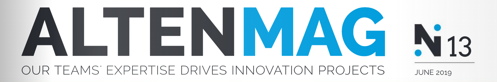
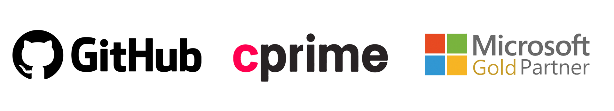

 

# Embedded Systems Sentinel
A [CodeQL](https://securitylab.github.com/tools/codeql/) query pack implementation to ensure code safety, security, portability, and reliability in the context of embedded systems. This query pack validates code quality for [MISRA C](https://en.wikipedia.org/wiki/MISRA_C) and [AUTOSAR](https://www.autosar.org/) compliance.

[Embedded Systems Sentinel](https://cprime-labs.github.io/es-sentinel/) and [GitHub CodeQL](https://securitylab.github.com/tools/codeql/) can only be used on codebases that are released under an OSI-approved open source license, or to perform academic research, or to generate CodeQL databases for or during automated analysis, continuous integration (CI) or continuous delivery (CD) in the following cases: (1) on any Open Source Codebase hosted and maintained on GitHub.com, and (2) to test CodeQL queries you have released under an OSI-approved open source software license. It can't be used for automated analysis, continuous integration or continuous delivery, whether as part of normal software engineering processes or otherwise, except in the express cases set forth herein. For these uses, [contact the sales team](sentinel@cprime.com).

## Documentation

Comprehensive documentation for this repo can be found in the [github pages](https://cprime-labs.github.io/es-sentinel/) website hosted within this repo.

## Project Management

Tasks and issues that relate to development of this repo can be found in this repo's [project board](https://github.com/cprime-labs/es-sentinel/projects/1).

## How to use this repo

Follow these steps to fully implement this repo:

#### Step 0: GitHub.
If you are viewing this readme by any other means go to the canonical repository on [GitHub](https://github.com/cprime-labs/es-sentinel) for the most up to date version of this repo.

#### Step 1: Launch Gitpod IDE.
- If you don't already have it installed we recommend using the [GitPod Browser Extension](https://www.gitpod.io/docs/browser-extension/).
- On the home page for this repo, select the branch you want to base your work on then click 'GitPod'. Alternatively click this url https://gitpod.io/#https://github.com/cprime-labs/es-sentinel
- Gitpod will now launch.

#### Step 3: Run the tests.
- From the command prompt in the project root of this repo, execute the following command.
- `make sentinel/serve-local`

#### Step 5: Eat, Sleep, Code, Repeat!
- Create a local working branch for whatever feature you are working on.
- Run local tests to ensure you won't push a breaking build.
- Push your branch to origin to trigger an automated CI build.
- If the automated CI build passed, create a pull request to have your code merged to the master branch.
- Rinse and repeat! Happy coding :)

## Tooling

The following tools are not strictly required to work with this repo but we recommend their use and used them oursleves in the creation of this repo:
- [GitHub](https://GitHub.com): GitHub, Inc. is a provider of Internet hosting for software development and version control using Git. It offers the distributed version control and source code management functionality of Git, plus its own features. 
- [Gitpod](https://www.gitpod.io/): Gitpod streamlines developer workflows by providing prebuilt, collaborative development environments in your browser - powered by VS Code.

## Who maintains this repo?

This repo is maintained by CPrime Engineering. If you're looking for support, send an email to [engineering@cprime.com](mailto:engineering@cprime.com?subject=DevOps%20Library%20VPC%20AWS).
CPrime Engineering can help with:

- Setup, customization, and support for this repo.
- Modules for other types of infrastructure, such as VPCs, Docker clusters, databases, and continuous integration.
- Modules that meet compliance requirements, such as HIPAA.
- Consulting & Training on Azure, AWS, Terraform, and DevOps.
## How do I contribute to this repo?

Contributions are welcome. Check out the
[Contribution Guidelines](/CONTRIBUTING.md) and 
[Code of Conduct](/CONDUCT.md) for instructions.

## How is this repo versioned?

This repo follows the principles of [Semantic Versioning](http://semver.org/). You can find each new release,
along with the changelog, in the [Releases Page](../../releases).

During initial development, the major version will be 0 (e.g., `0.x.y`), which indicates the code does not yet have a
stable API. Once we hit `1.0.0`, we will make every effort to maintain a backwards compatible API and use the MAJOR,
MINOR, and PATCH versions on each release to indicate any incompatibilities.

Publication of the CHANGELOG for this repo is automated using [git-changelog](https://github.com/git-chglog/git-chglog) in the style of [Keep a Changelog](https://keepachangelog.com/en/1.0.0/).

## Architectural Decisions

All architectural decisions made in the authoring of this repo are captured as a log of [Architecture Decision Records](http://thinkrelevance.com/blog/2011/11/15/documenting-architecture-decisions) (ADRs). This log can be found in the [adr/en](adr/en) sub directory of this repo.

Creation of architecural decision records relating to this repo is automated using [adr-tools](https://github.com/npryce/adr-tools).

## License

This code is released under the MIT License. Please see
[LICENSE](/LICENSE) and [NOTICE](/NOTICE) for more details.

